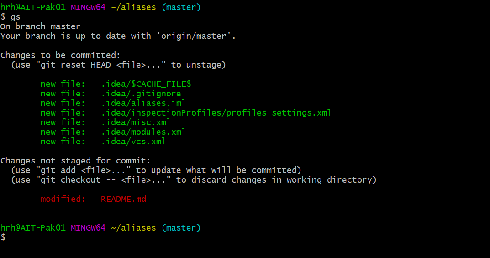

# Easy Git Bash Aliases
1) Download/Clone the file
2) Add this into your .bash_profile file: export PATH=~/.aliases:PATH

3) At this point you are done. e.g: Typing 'gs' should expand to 'git status'

**Note**: In some cases you might need to add command: source PATH_TO_ALIASES_FILE
